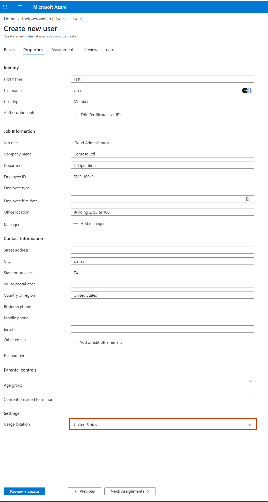
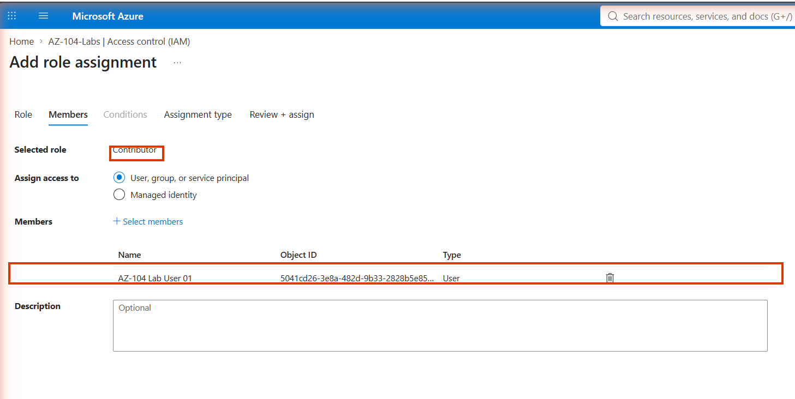
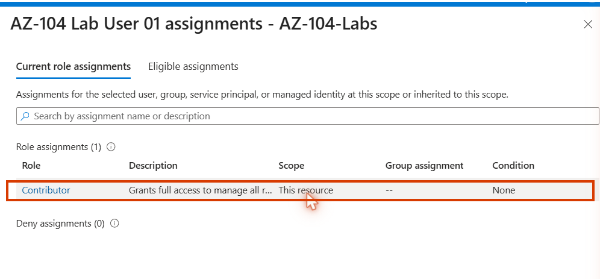
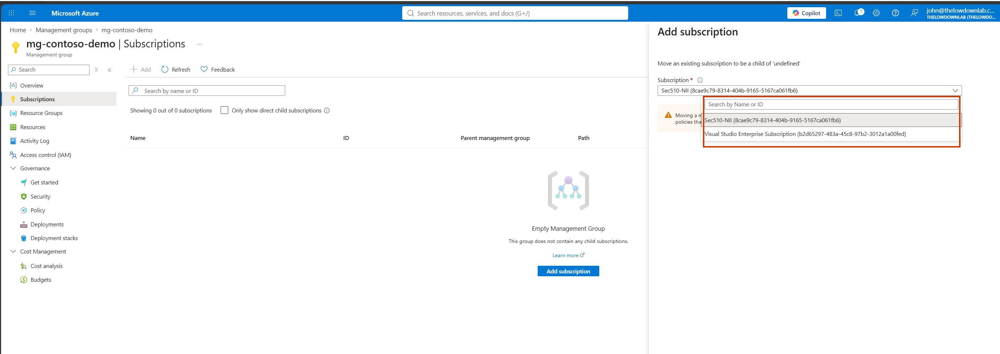

# Walkthrough — Custom RBAC Roles & Scope Hierarchy (Lab 01)

A guided, portal-first walkthrough of what [Lab 01](../../labs/01-custom-rbac-scope/) deploys. The lab README covers the Bicep deploy/verify/cleanup commands — this walkthrough is for clicking through the portal afterward so the custom role and the scope hierarchy stop being abstractions and become things you've actually read and navigated.

**Prerequisite:** Lab 01 is already deployed (`az deployment sub create ...` from the lab README) and you have the Azure Portal open at [portal.azure.com](https://portal.azure.com).

## Part 0 (optional) — Create a test principal

If you're doing the lab's optional manual task of creating a second test user to assign Reader to: **Microsoft Entra ID → Users → + New user → Create new user**, then set the display name, user principal name, and usage location.

**Step shown:** Create new user → Properties tab → Usage location field.

*(This capture is from the study guide's generic example, not this lab's own tenant — the blade layout is identical either way.)*

## Part 1 — Find the role assignments

1. Open your resource group (`rg-az104-lab01`).
2. In the left-hand menu, select **Access control (IAM)**.
3. Click the **Role assignments** tab.
4. Find your principal listed twice: once under **AZ-104 Lab 01 Storage Operator**, once under **Reader**.

**Step shown:** Access control (IAM) → Add role assignment → Members tab, with a principal selected.

*(Shown here with the built-in Contributor role as a generic example of this screen — your own Members tab will show AZ-104 Lab 01 Storage Operator or Reader instead, per this lab's Bicep.)*

Notice both assignments share the same scope — this resource group — but come from two different role definitions.

## Part 2 — Read the custom role's JSON

1. Still in **Access control (IAM)**, click the **Roles** tab.
2. Search for **AZ-104 Lab 01 Storage Operator**.
3. Click the role, then click **View** (or the "..." menu → **View**).
4. Open the **JSON** tab of the role detail pane.
5. Read the `actions` array: `Microsoft.Storage/storageAccounts/read`, `.../write`, `.../listkeys/action`. Notice there's no delete action anywhere, and `notActions` is empty — the delete permission isn't explicitly excluded, it simply was never granted.

Compare this against a built-in role: search **Storage Account Contributor** in the same **Roles** tab and open its JSON. You'll see a broader action set that does include delete — the exact permission this lab's custom role was written to leave out.

## Part 3 — Check access for your principal

1. In **Access control (IAM)**, click **Check access**.
2. Search for your own account (or the test principal from the lab's manual tasks, if you created one).
3. Select it, and read the **Current access** panel that appears — it lists both **AZ-104 Lab 01 Storage Operator** and **Reader**, with the scope each came from.

**Step shown:** Access control (IAM) → Check access → result panel for a selected user.

This is the same tool you'd use in a real support ticket: "why can/can't this user do X" almost always starts with Check access at the scope in question.

## Part 4 — Tour the scope hierarchy (read-only)

1. In the portal search bar, go to **Management groups**.
2. Look at whatever hierarchy exists in your tenant above the subscription level. If your tenant has never set one up, you'll see the default root management group with your subscription underneath it. For reference, here's the **Add subscription** blade you'd use if you ever did move one into a management group:

**Step shown:** Management groups → Subscriptions tab → Add subscription blade.

3. **Do not move your subscription into a different management group.** This walkthrough is look-only — moving a production subscription changes policy and RBAC inheritance for everything underneath it, and undoing that cleanly is not guaranteed.
4. Click into your subscription's own **Access control (IAM)** blade and compare its role assignments against the resource group's. Any role assigned at the subscription would show up as "inherited" if you checked access at the resource-group level — which is the hierarchy in action, just not one this lab's Bicep actually created.

## What you learned

Walking through this lab in the portal, you should now be able to:

- **Read a custom role's JSON definition** and identify exactly which actions it grants versus a comparable built-in role.
- **Locate role assignments in Access control (IAM)** and tell apart a custom role assignment from a built-in one at the same scope.
- **Use Check access** to look up a principal's effective permissions — the practical, portal-native way to answer "can this identity do X here."
- **Navigate to Management groups** and recognize where they sit in the hierarchy above subscriptions, without needing to alter anything there.
- **Explain, from direct observation, why custom roles are normally defined at subscription scope** even when a given assignment only targets one resource group.
