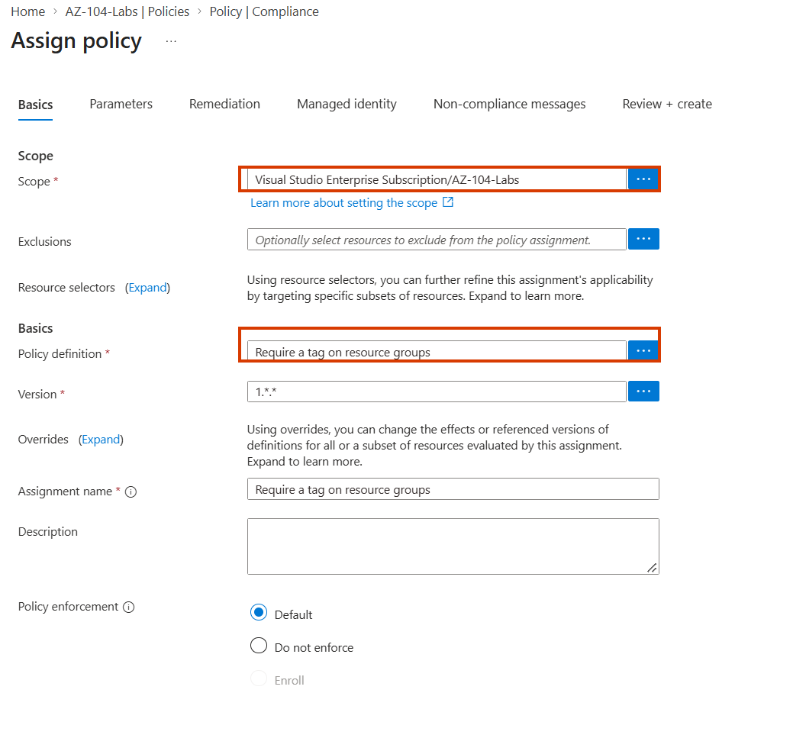
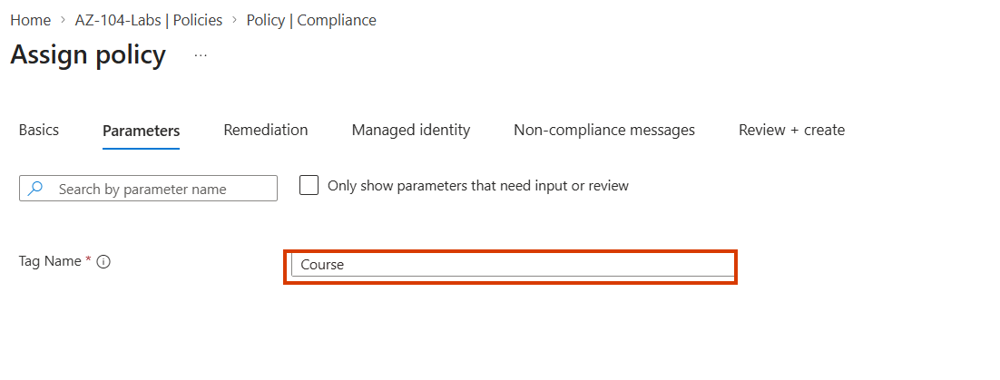
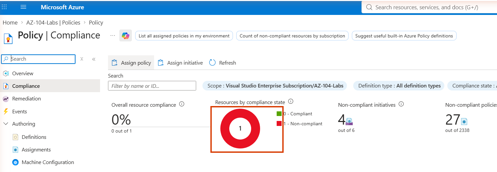

# Walkthrough — Azure Policy: Initiatives & Remediation (Lab 02)

A guided, portal-first walkthrough of what [Lab 02](../../labs/02-azure-policy-initiatives/) deploys. The lab README covers the Bicep deploy/verify/cleanup commands — this walkthrough is for clicking through the Policy blade afterward so "initiative," "managed identity," and "remediation task" stop being vocabulary and become things you've actually watched run.

**Prerequisite:** Lab 02 is already deployed (`az deployment sub create ...` from the lab README) and you have the Azure Portal open at [portal.azure.com](https://portal.azure.com).

## Part 1 — Read both individual policy definitions

1. In the portal search bar, go to **Policy**.
2. Select **Definitions** in the left menu.
3. Search for "AZ-104 Lab 02" — open **AZ-104 Lab 02: Append costCenter tag to resource groups**.
4. Click the **JSON** (or **Policy rule**) view and find the `then.effect: "modify"` block. Notice the `roleDefinitionIds` array sitting inside `details` — that's the built-in Tag Contributor role ID the assignment's managed identity will be granted.
5. Clear the search and find the built-in policy **Require a tag on resource groups**. Open it read-only — notice its effect is `deny`/`audit` (parameterized), not `modify`. It only checks; it never writes.

## Part 2 — Find the grouped initiative

1. Still in **Policy → Definitions**, switch to the **Initiative definitions** tab (or filter the category).
2. Open **AZ-104 Lab 02: Resource group tagging initiative**.
3. Scroll to the **Policies included in this initiative** section — both the Modify policy and the built-in Require-a-tag policy are listed together under one initiative, each with its own parameter mapping.

This is the point worth pausing on: one assignment below is about to carry both of these at once.

## Part 3 — Open the assignment and its managed identity

1. Select **Assignments** in the Policy left menu.
2. Open **AZ-104 Lab 02: Tagging initiative assignment**.

**Step shown:** Assign policy wizard → Basics tab → scope and policy definition.

*(Generic example from the study guide, showing the Assign policy wizard's Basics tab — your own assignment will show the initiative rather than a single built-in definition.)*

3. Click the **Managed identity** tab. You'll see a **System assigned** identity, enabled.

**Step shown:** Assign policy wizard → Parameters tab.

4. In a new tab, go to that identity's object in **Microsoft Entra ID → Enterprise applications** (search its object ID), or simply go to `rg-az104-lab02 → Access control (IAM) → Role assignments` and find the **Tag Contributor** role assigned to a principal whose name matches the policy assignment — that's the identity's role grant, created automatically when the assignment was deployed with `identity: SystemAssigned`.

## Part 4 — Check compliance

1. Select **Compliance** in the Policy left menu.
2. Find the initiative (or drill into the individual Modify policy). Compliance state may take up to 30 minutes to populate fully after a fresh assignment — if it still reads "Not started" or shows no data yet, that's expected, not broken.
3. Once populated, `rg-az104-lab02` should show as a remediated/compliant resource for the Modify policy.

**Step shown:** Policy → Compliance view for the assignment.

## Part 5 — Watch the remediation task

1. Select **Remediation** in the Policy left menu.
2. Under **Remediation tasks**, find `az104-lab02-remediation`.
3. Open it and look at its **Resources** tab — it lists `rg-az104-lab02` and the outcome of the remediation attempt.
4. If the task is still `Running`, give it a few minutes and refresh. Once `Succeeded`, go back to `rg-az104-lab02`'s **Tags** blade and confirm the `costCenter` tag is now present with the default value the policy wrote.

This is the payoff moment: the resource group didn't have the tag when the policy was assigned, and nobody manually added it — the remediation task did.

## What you learned

Walking through this lab in the portal, you should now be able to:

- **Read a Modify policy's JSON** and locate the `roleDefinitionIds` that declare what permissions its managed identity will need.
- **Locate an initiative definition** and see which individual policies it groups together, each with its own parameter mapping.
- **Find and inspect a policy assignment's managed identity**, and trace the role assignment Azure created for it automatically.
- **Read Policy → Compliance** at both the initiative and individual-policy level, and recognize that compliance data can take time to populate.
- **Monitor a remediation task to completion** and verify, by checking the resource's own tags afterward, that the task actually fixed something that predated the policy.
