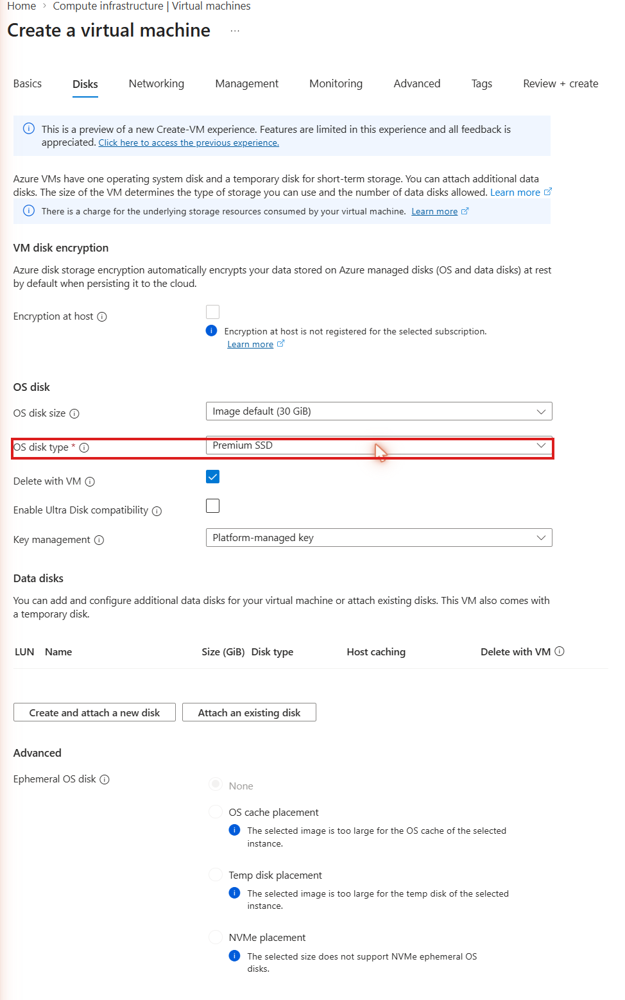
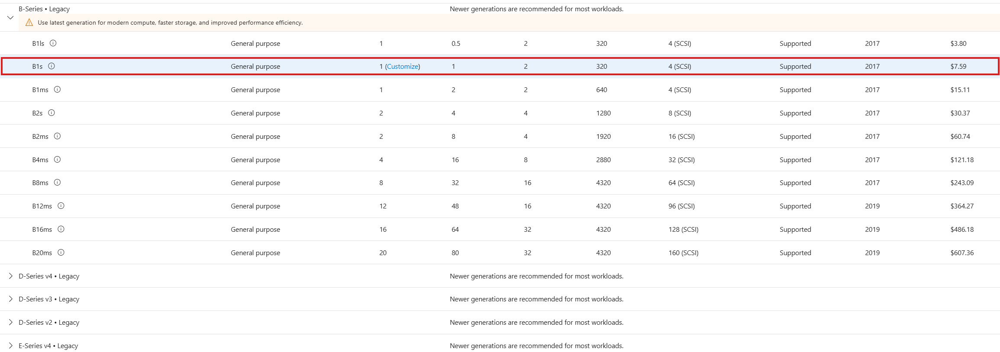

# Walkthrough — VM Deployment, Availability Zones & Managed Disks (Lab 06)

A guided, portal-first walkthrough of what [Lab 06](../../labs/06-vm-availability-disks/) deploys. The lab README covers the Bicep deploy/verify/cleanup commands — this walkthrough is for clicking through the portal afterward so "availability zone" and "managed disk SKU" stop being terms on a slide and become things you've actually located on a real VM.

**Prerequisite:** Lab 06 is already deployed (`az deployment group create ...` from the lab README) and you have the resource group open in the [Azure Portal](https://portal.azure.com).

## Part 1 — Confirm the assigned zone

1. Open your resource group (`rg-az104-lab06`) and click into **vm-az104lab06**.
2. On the **Overview** page, look at the line showing **Region**. The availability zone the VM landed in is shown right alongside it (e.g. "East US (Zone 1)").
3. Scroll down to the **Properties** tab for the same information in a flatter, more explicit layout if Overview doesn't show it clearly.

This is the zone you set with the `vmZone` parameter at deploy time (default `1`). If you'd deployed a second VM with `vmZone=2`, it would land in a physically separate datacenter facility from this one — not just a different rack.

## Part 2 — Inspect the managed disk

1. In the VM's left-hand menu, under **Settings**, select **Disks**.
2. Click the OS disk's name to open its own resource blade.
3. On the disk's **Overview**, confirm the **SKU** reads **Premium SSD LRS** and note the **Size** (GiB) provisioned from the image.

*(This is the create-time equivalent of what the disk's Overview shows after the fact — same Premium SSD choice, captured at deploy time instead of read back afterward.)*

4. Go back to the disk's **Size + performance** page (under Settings) to see the IOPS/throughput tier that SKU and size combination gives you — this is the number a "why did we pick Premium here" conversation is actually about.

## Part 3 — Confirm encryption at host

1. Back on the VM, go to **Settings → Disks**.
2. Scroll to the bottom of the Disks blade to the **Encryption at host** toggle/indicator — it should show as enabled, matching the `securityProfile.encryptionAtHost: true` set in the Bicep.
3. If this VM had instead used Azure Disk Encryption, you'd look for it somewhere entirely different (the disk's own **Encryption** blade, OS-level) — a good moment to point out these two controls don't live in the same place in the portal because they aren't the same thing.

## Part 4 — Browse the filtered resize list (optional — no need to commit to it)

1. On the VM, go to **Settings → Size**.
2. Look at the list of available sizes. Every option shown is filtered to what the VM's **current hardware cluster** actually supports — this is the same constraint `az vm resize` runs into from the CLI.

3. You don't need to actually pick a new size and resize for this walkthrough — the teaching point is seeing the filtered list exist, not completing a live resize (which would restart the VM). If you do want to demo it live, selecting a size and clicking **Resize** triggers the same restart/brief-downtime behavior described in the lab README's manual tasks.

## Part 5 — Tour the network stack

1. Still on the VM, go to **Settings → Networking**.
2. Confirm the attached NIC, its private IP, and the public IP address (`pip-az104lab06`).
3. Click into the **Network security group** shown here to confirm the single inbound rule (`Allow-SSH-Inbound`) and its source address scope — `*` by default, the same "never ship this to production" default called out in AZ-900 Lab 9.

## Part 6 — Compare an availability-set deployment (optional)

Only relevant if you redeployed this lab with `--parameters deploymentTarget=availabilitySet` (see the lab README's Deploy section — this replaces the zone-based VM, it doesn't add a second one).

1. In the portal's top search bar, search for **avail-az104lab06** and open it directly — this is the availability set resource itself, not something you'll find nested under the VM.
2. On its **Overview** page, confirm **Fault domains: 2** and **Update domains: 5**, and note the **SKU** listed as **Aligned**.

3. Scroll down to **Virtual machines** on this same blade and confirm `vm-az104lab06` is listed as a member.
4. Now go back to the VM's own **Overview** page (Part 1) and compare: there is no zone field here at all, in contrast to the zone-based deployment where a zone number sits right next to **Region**. That absence is itself the tell — an availability-set VM simply doesn't carry a zone property, because the two placement mechanisms are mutually exclusive.

## What you learned

Walking through this lab in the portal, you should now be able to:

- **Locate a VM's assigned availability zone** in the portal and distinguish it visually from an availability-set-based deployment (which shows no zone at all).
- **Read a managed disk's SKU and performance tier** from its own resource blade, separate from the VM that uses it.
- **Find where encryption-at-host is surfaced in the portal** and explain why it's a different control, in a different place, from Azure Disk Encryption.
- **Recognize the VM Size blade's filtered list** as the same hardware-cluster constraint that governs `az vm resize` from the CLI.
- **Trace a VM's network stack** — NIC, public IP, and NSG — back to the individual Bicep resources that created them.
- **Locate an availability set's own resource blade** (fault domains, update domains, member VMs) and contrast it with a zone-based VM's Overview page, which carries no availability-set information at all.
