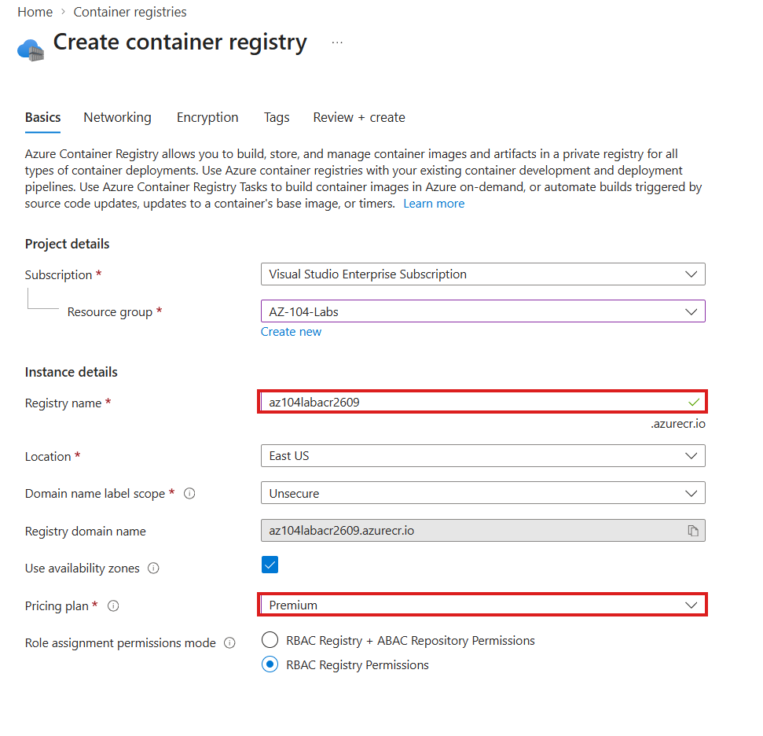
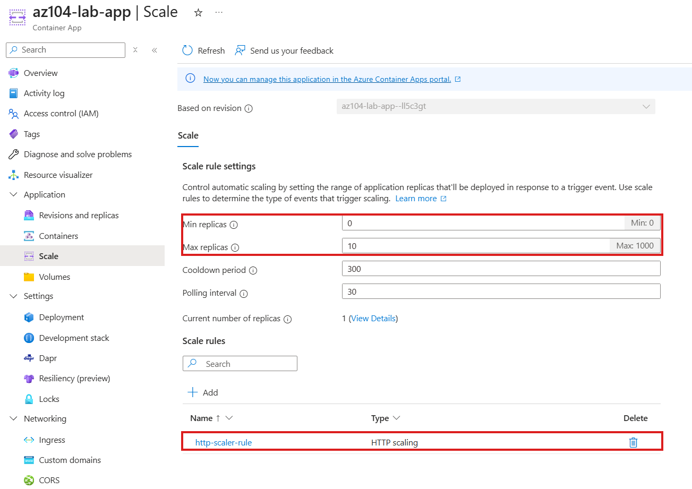

# Walkthrough — Containers: Registry, Container Instances & Container Apps (Lab 08)

A guided, portal-first walkthrough of what [Lab 08](../../labs/08-containers-acr-aci-apps/) deploys. The lab README covers the Bicep deploy/verify/cleanup commands — this walkthrough is for clicking through all three container services side by side so their differences stop being a memorized list and become three things you've actually opened in the portal.

**Prerequisite:** Lab 08 is already deployed (`az deployment group create ...` from the lab README) and you have the resource group open in the [Azure Portal](https://portal.azure.com).

## Part 1 — The registry: stores images, runs nothing

1. Open your resource group (`rg-az104-lab08`) and click into the container registry.

*(Create-time view, shown for reference — your registry already exists from this lab's Bicep on the Basic SKU rather than Premium.)*

2. In the left-hand menu, select **Repositories**.
3. If you completed the lab README's optional `az acr build` manual task, you'll see a `demo` repository with a `v1` tag here. If you skipped it, the list is empty — and that's the point worth saying out loud: **an empty registry is still a fully valid, fully billed registry.** It doesn't need to be running anything to exist or to cost money.
4. Open **Settings → Access keys** briefly — note `adminUserEnabled` is off in this template (Azure AD / RBAC-based access is the modern recommended path over the legacy admin account).

## Part 2 — The Container Instance: one container, no orchestration, bills while running

1. Back in the resource group, open the container instance (`aci-az104lab08`).
2. On **Overview**, confirm the **Status** shows **Running** and note the **FQDN** — open it in a new tab to see the hello-world response.
3. In the left-hand menu, select **Containers**, then the **Logs** tab to see startup output, and the **Events** tab for lifecycle events (pulled image, started, etc.).
4. Go to **Settings → Properties** and find `restartPolicy: Never`. Point out that this is the only thing standing between "demo container" and "container that silently restarts and bills forever if the process inside ever exits."

## Part 3 — The Container App: scale-to-zero, HTTP-based

1. Open the Container App (`ca-az104lab08`).
2. On **Overview**, open the **Application Url** to confirm it responds.
3. In the left-hand menu, under **Application**, select **Scale**.
4. Confirm **Min replicas: 0**, **Max replicas: 1**, and the HTTP scale rule (`http-scale-rule`, concurrent requests threshold `10`).

5. Go to **Revisions and replicas** — if no traffic has hit the app recently, you may see **0 replicas running**. That's the scale-to-zero behavior working as designed, not a failure: unlike the Container Instance in Part 2, an idle Container App isn't running (or billing for compute) at all until a request arrives.

## Part 4 — The managed environment underneath it

1. Still on the Container App, scroll to **Environment** on the Overview page and click through to **cae-az104lab08**.
2. On the environment's **Overview**, note that it's the shared boundary a Container App runs inside — this is the piece that, internally, is backed by Kubernetes even though nothing in this portal experience asks you to manage a cluster.
3. Open **Monitoring → Logs** on the environment (or the Log Analytics workspace it's wired to) to see where the app's console output actually lands.

## What you learned

Walking through this lab in the portal, you should now be able to:

- **Open all three container services in the portal** and state, from what you actually saw, what each one does and does not run.
- **Read a Container Instance's restart policy** and explain why `Never` matters for cost control.
- **Read a Container App's scale configuration** (min/max replicas, HTTP scale rule) and recognize 0 running replicas as expected idle behavior, not an error.
- **Locate the managed environment** underneath a Container App and describe it as the shared Kubernetes-backed boundary the app runs inside.
- **Explain, from direct comparison, why an idle Container Instance still costs money while an idle Container App does not.**
