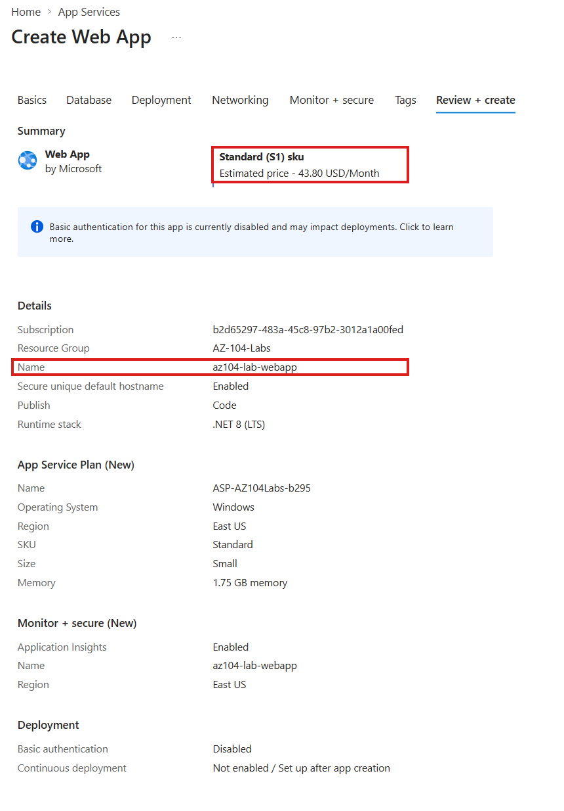
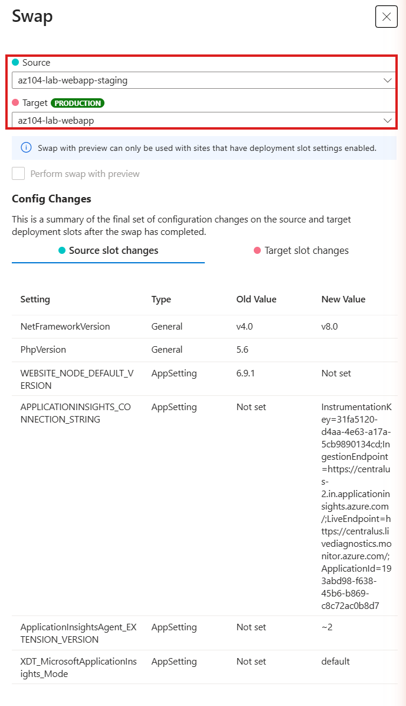

# Walkthrough — App Service: Deployment Slots & VNet Integration (Lab 09)

A guided, portal-first walkthrough of what [Lab 09](../../labs/09-app-service-advanced/) deploys. The lab README covers the Bicep deploy/verify/cleanup commands — this walkthrough is for clicking through the portal afterward so slots and VNet integration stop being diagram boxes and become things you've actually seen side by side on a real app.

**Prerequisite:** Lab 09 is already deployed (`az deployment group create ...` from the lab README) and you have the resource group open in the [Azure Portal](https://portal.azure.com).

## Part 1 — Production and staging, side by side

1. Open your resource group (`rg-az104-lab09`) and click into your web app.

*(Create-time view, shown for reference — this lab's Bicep already provisioned the app on a Standard S1 plan, which is what actually enables the deployment slot used below.)*

2. In the left-hand menu, under **Deployment**, select **Deployment slots**.
3. You'll see two rows: **production** and **staging**, each with its own independent URL (`<app>.azurewebsites.net` and `<app>-staging.azurewebsites.net`).
4. Open both URLs in separate tabs. Both show the same default placeholder page right now — that's expected, since neither has custom code deployed, but notice they are two fully separate running instances, not one app with a flag.

## Part 2 — The swap dialog (look, don't have to commit)

1. Still on **Deployment slots**, click **Swap**.
2. In the swap dialog, set **Source** to `staging` and **Target** to `production`.
3. Look for the **Preview changes** option before confirming — this lets you see exactly what configuration would change on each side before the swap actually happens.

4. You can cancel out of this dialog without swapping anything — the point of this part is seeing the dialog's shape, not necessarily executing a live swap during the walkthrough. If you do want to run one for real, use the `az webapp deployment slot swap` command from the lab README's manual tasks instead, so you have a clean audit trail of exactly what you ran.

## Part 3 — VNet integration status

1. In the left-hand menu, under **Settings**, select **Networking**.
2. Find **VNet integration** and confirm it shows as connected to `vnet-az104lab09`, subnet `snet-appservice-integration`.
3. Click through to the VNet itself, then into the subnet, and confirm the subnet's **Delegated to** field reads `Microsoft.Web/serverFarms` — this delegation is what makes the subnet eligible for App Service VNet integration in the first place; without it, the attach would fail outright.
4. Say out loud what this view does *not* show: nothing here makes inbound traffic to the app private. This subnet is strictly about the app reaching things inside the VNet — outbound only.

## Part 4 — Where Custom domains and Backup live (read-only tour)

1. Still in the left-hand menu, locate **Custom domains** (under **Settings**) and **Backups** (under **Deployment**). Open each one briefly.
2. **Custom domains** will be empty — this is where you'd add a hostname you actually own, validate it via a DNS record at your registrar, and bind a managed or uploaded certificate. No action needed here for this lab.
3. **Backups** will show a prompt to configure a storage account — this is where App Service Backup is wired up, and it requires picking (or creating) a storage account and SAS URL. Also no action needed here.
4. The point of this part is knowing where these two blades live for when you actually need them later, not configuring either one now.

## Part 5 — Scale up vs. scale out, two separate blades

1. In the left-hand menu, under **Settings**, select **Scale up (App Service plan)**.
2. This blade is entirely about **SKU/tier** — a grid of pricing tiers (Free/Shared, Basic, Standard, Premium v2/v3, Isolated) with their CPU/memory/feature specs. Confirm your plan currently shows **S1 (Standard)** selected. Don't actually apply a change here unless you intend to pay for it — this lab's cost warning applies double to Premium tiers.
3. Now select **Scale out (App Service plan)**, a completely different blade in the same **Settings** section.
4. This one is entirely about **instance count** — a slider or manual instance-count field, with no SKU/tier selector anywhere on the page. Confirm it currently shows **1 instance**.
5. Look at both blades side by side (open one, note its layout, then switch to the other) and notice neither one lets you do what the other does — Scale up has no instance-count control, Scale out has no tier grid. That separation is the portal reinforcing the same up-vs-out distinction the CLI commands in the lab README's manual tasks demonstrate.

## What you learned

Walking through this lab in the portal, you should now be able to:

- **Locate production and staging deployment slots** and confirm each has its own independent URL and running instance.
- **Open the slot swap dialog**, including the **Preview changes** option, and explain what a swap exchanges versus a fresh deployment.
- **Confirm VNet integration status** on a Web App and trace it back to a subnet delegation on the VNet side.
- **Explain, from what the Networking blade does and doesn't show, that regional VNet integration is outbound-only.**
- **Locate the Custom domains and Backups blades** so you know where to configure them later, without needing to complete either step in this lab.
- **Find the Scale up and Scale out blades as two separate portal experiences** and explain, from what each blade does and doesn't contain, that one changes the plan's tier and the other changes its instance count.
