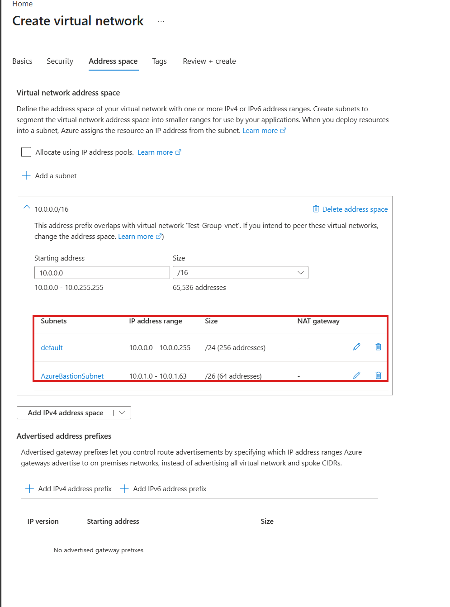
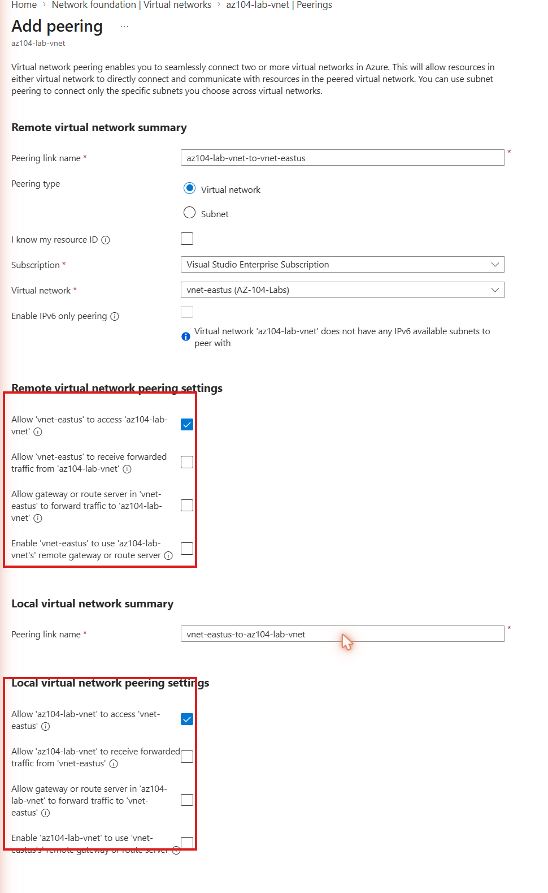
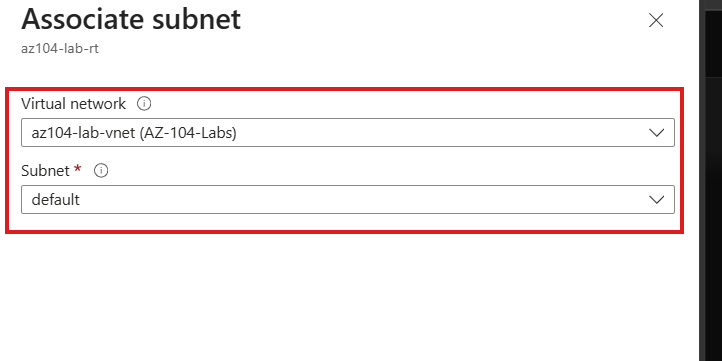
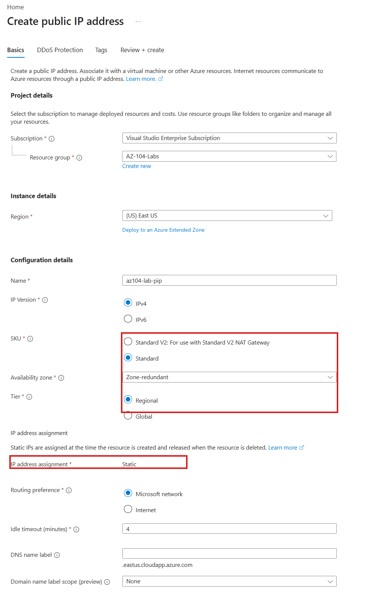

# Walkthrough — VNet Peering & User-Defined Routes (Lab 10)

A guided, portal-first walkthrough of what [Lab 10](../../labs/10-vnet-peering-routing/) deploys. The lab README covers the Bicep deploy/verify/cleanup commands — this walkthrough is for clicking through the Peerings and Route tables blades afterward, so "peering is two resources" and "a UDR needs a subnet association to do anything" stop being README bullet points and become things you've actually verified.

**Prerequisite:** Lab 10 is already deployed (`az deployment group create ...` from the lab README) and you have the resource group open in the [Azure Portal](https://portal.azure.com).

For reference, here's the VNet-create experience that produces the address space and subnet layout this lab's Bicep deployed directly:

## Part 1 — Find both sides of the peering, and see why there are two

1. Open `rg-az104-lab10` and click into `vnet-az104lab10-hub`.
2. In the left-hand menu, under **Settings**, select **Peerings**.
3. You'll see one entry, `peer-hub-to-spoke`, status **Connected**.
4. Open it. Scroll to the gateway section and notice **Allow gateway transit** is unchecked (read-only here) — this is the hub side, and it's set to `false` because this lab deploys no VPN/ExpressRoute gateway for the hub to offer.
5. Now open `vnet-az104lab10-spoke` and its own **Peerings** blade. You'll see a *different* entry, `peer-spoke-to-hub`, also **Connected**. Open it and notice **Use remote gateways** is unchecked — the mirror-image flag, set on the side that would consume a gateway if one existed.

Stop here and compare what you just did to the portal's own peering wizard: if you clicked **+ Add peering** from either VNet's Peerings blade, the portal would prompt you once and create *both* of these objects for you behind the scenes.

The Bicep template in this lab created them as two separate, explicit resources instead — same end result, but now you've seen both halves individually rather than through a wizard that hides the seam.

## Part 2 — Confirm the UDR is actually associated, not just defined

1. In the portal search bar, find `rt-az104lab10-spoke`.
2. Select **Routes** in the left menu. You'll see one route, `Route-Default-To-NVA`: address prefix `0.0.0.0/0`, next hop type **Virtual appliance**, next hop IP `10.0.0.4`.
3. Now select **Subnets** in the left menu. You'll see `snet-spoke-workload` listed as associated.

This is the point worth making live: a route table existing and having routes in it is not the same as it doing anything. If the Subnets blade came back empty, this UDR would be completely inert — correctly configured, silently doing nothing. Go check `vnet-az104lab10-hub`'s subnet the same way (open its **Subnets** blade) and notice the hub workload subnet has no route table associated at all — only the spoke subnet does, by design.

4. Click on the `10.0.0.4` next hop IP mentally (there's nothing to actually click — it's just a string). Point out there is no VM, firewall, or NVA appliance anywhere in this resource group at that address. Azure doesn't check. If you deployed a VM at `10.0.0.4` in the hub's workload subnet right now, traffic would start flowing there; until you do, this route just points into empty space.

## Part 3 — Look at the public IP's properties

1. In the portal search bar, find `pip-az104lab10`.
2. On its **Overview** page, note three fields together: **SKU** (Standard), **Assignment** (Static), and **Availability zone** (Zone-redundant, reflecting all three zones from the template).

3. Compare this mentally to a Basic SKU public IP (if you have one from an older lab or sandbox) — Basic has no zone field at all, because Basic IPs aren't zone-redundant.

Nothing is attached to this IP in this lab — that's intentional. You're inspecting the resource's own properties here, not its usage. A later lab attaches a public IP of this exact shape to an Azure Bastion host; another attaches one to a Load Balancer.

## What you learned

Walking through this lab in the portal, you should now be able to:

- **Locate both sides of a VNet peering independently**, one blade per VNet, and explain why Resource Manager models peering as two objects instead of one, in contrast to the portal's single-wizard experience.
- **Read the gateway-transit flags on each side of a peering** and state which VNet would be offering a gateway versus which would be consuming one, even with no gateway deployed.
- **Verify a route table's subnet association directly**, rather than assuming a route table with routes in it is automatically doing something.
- **Explain, from direct observation, that Azure does not validate a UDR's next-hop IP** — the route table looked complete with no appliance anywhere behind the address it names.
- **Read a Standard public IP's SKU, allocation method, and zone-redundancy fields** in the portal and explain why Standard, not Basic, is now the default choice regardless of cost.
