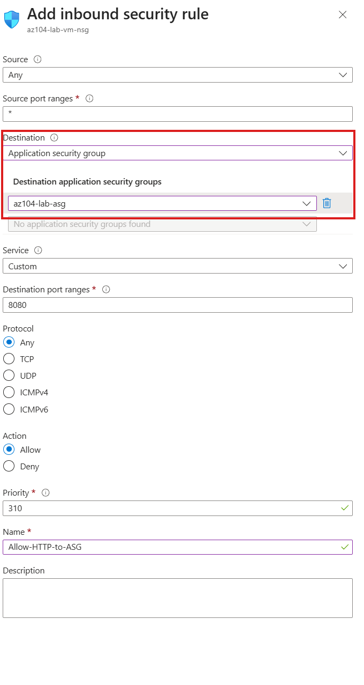
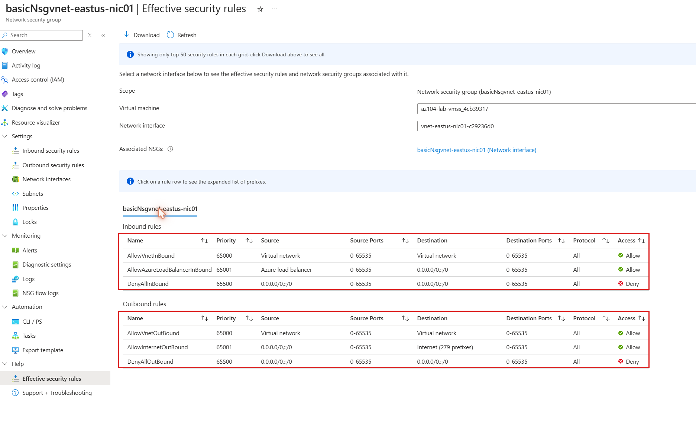
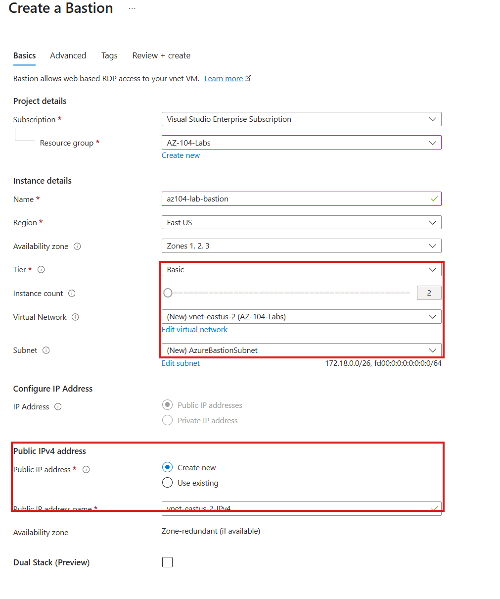
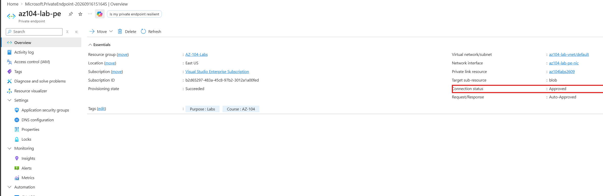
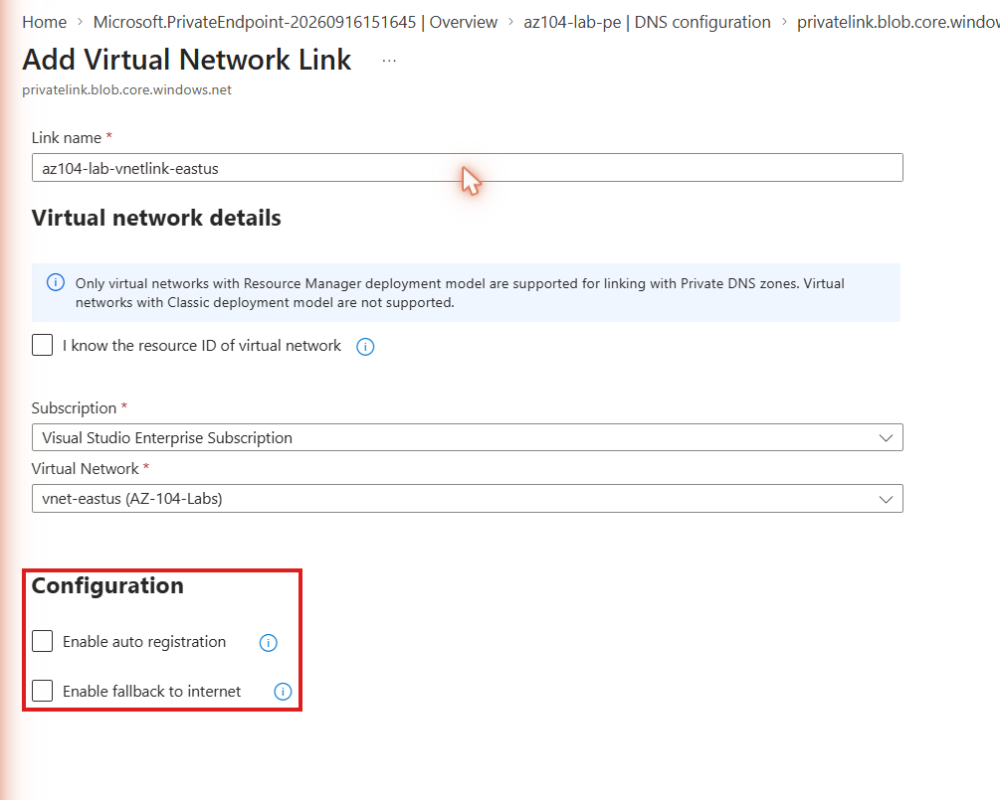

# Walkthrough — NSGs, Application Security Groups, Bastion & Private Endpoints (Lab 11)

A guided, portal-first walkthrough of what [Lab 11](../../labs/11-nsg-asg-bastion-endpoints/) deploys. The lab README covers the Bicep deploy/verify/cleanup commands — this walkthrough is for clicking through the NSG, Bastion, and private endpoint blades afterward, so "ASG destination rule," "effective security rules," and "private DNS zone group" stop being vocabulary and become things you've actually seen.

**Prerequisite:** Lab 11 is already deployed (`az deployment group create ...` from the lab README) and you have the resource group open in the [Azure Portal](https://portal.azure.com). **Reminder: Bastion is billing by the hour right now — don't let this walkthrough run long before you get to Part 5's cleanup.**

## Part 1 — The NSG rule with an ASG as its destination

1. Open `rg-az104-lab11` and find `nsg-az104lab11`.
2. Select **Inbound security rules** in the left menu.
3. Open `Allow-HTTPS-From-Internet-To-Web-ASG`. Look at the **Destination** field — instead of an IP address or CIDR range, it names `asg-az104lab11-web` directly.

4. Back out to the rules list and scroll past it — you won't see `AllowVnetInBound`, `AllowAzureLoadBalancerInBound`, or `DenyAllInBound` listed here. Those are **default rules**, and the portal shows them on a separate tab or further down the list depending on your view — look for a **Default rules** section or toggle. They exist whether or not you wrote them.

## Part 2 — Effective security rules (if you have a NIC to point it at)

This step needs an actual NIC in this VNet — this lab deploys none by default, to avoid an extra billable resource. If you have a VM here (for instance, one redeployed from an earlier lab into `vnet-az104lab11` for practice), do this:

1. Open that VM → **Networking** in the left menu.
2. Click the NIC's name, then **Effective security rules** in its own left menu (or the equivalent link from the VM's Networking page).
3. You'll see your custom ASG-destination rule sitting alongside Azure's default rules, merged into one evaluated list.

If you don't have a VM handy, skip this and just remember the CLI equivalent from the lab README: `az network nic list-effective-nsg`. The concept — custom rules and default rules merge — is the testable point regardless of whether you have a live NIC to check it against today.

## Part 3 — Azure Bastion

1. In the portal search bar, find `bas-az104lab11`.
2. On its **Overview** page, note the **Tier** (Standard) and the public IP it's using (`pip-az104lab11-bastion`).

*(This capture shows the **Basic** tier selected as a generic example — this lab specifically deploys **Standard**, which is what unlocks the extra Bastion features called out in the lab README. Double-check the Tier field reads Standard on your own deployment, not Basic.)*
3. If you have a VM in this VNet, try connecting: select **Connect** from the Bastion resource (or from the VM's own **Connect → Bastion** tab) and sign in with the VM's credentials. This step is optional — call it out as optional if no VM exists here, since deploying one solely to test Bastion adds cost this lab's README deliberately avoided.
4. Notice what's absent from the VM itself throughout this: no public IP, and no inbound NSG rule for RDP or SSH from the internet. That's the entire point of Bastion.

## Part 4 — The private endpoint and its connection

1. Find the storage account (its name starts with `az104lab11` followed by a generated suffix — get the exact name from the lab's deployment output: `az deployment group show --resource-group rg-az104-lab11 --name main --query properties.outputs.storageAccountName.value -o tsv`).
2. Open it, then **Networking** in the left menu, then the **Private endpoint connections** tab.
3. You'll see one connection, `pe-az104lab11-blob`, status **Approved**.

4. Click into the private endpoint itself (`pe-az104lab11-blob`) and look at its **Overview** — it has its own private IP address inside `snet-workload`, distinct from the storage account's public endpoint.

## Part 5 — The private DNS zone and its auto-registered record

1. In the portal search bar, find `privatelink.blob.core.windows.net`.
2. Select **Virtual network links** in the left menu — you'll see `link-az104lab11` linked to `vnet-az104lab11`, with **Auto registration** enabled.

3. Select **Overview** (or the record sets view) and look for an **A** record matching the storage account's name. This record was written automatically — not by the VNet link's auto-registration (that mechanism registers VM NICs, not private endpoints), but by the private endpoint's own **DNS zone group**, which you can see by going back to `pe-az104lab11-blob` → **DNS configuration** in its left menu.
4. This is the payoff moment: resolve `<account>.blob.core.windows.net` from inside the VNet and it returns the private IP from Part 4, not the public one — because this zone is linked to the VNet and holds that exact record.

## Part 6 — Clean up Bastion first

Bastion is the expensive resource here. Before you move on:

1. Go to `bas-az104lab11` → **Overview** → **Delete**. Confirm.
2. Wait for it to finish — this can take up to ~10 minutes. Don't assume it's stuck; Bastion deletion is genuinely slow.
3. Once it's gone, delete `pip-az104lab11-bastion` separately, then delete the rest of the resource group (or just run the lab README's cleanup commands instead — same effect).

## What you learned

Walking through this lab in the portal, you should now be able to:

- **Locate an NSG rule whose destination is an ASG** and distinguish it from an IP/CIDR-based rule at a glance.
- **Read effective security rules** on a NIC (when one is available) and explain why custom and default rules appear merged together.
- **Connect to a VM through Azure Bastion** (or describe the flow if no VM was available) and state what's missing from the VM's own network exposure as a result — no public IP, no internet-facing RDP/SSH rule.
- **Confirm a private endpoint's approval status and private IP** from the target PaaS resource's own Networking blade.
- **Trace name resolution for a private endpoint end to end** — the VNet link's auto-registration setting, and the private endpoint's own DNS zone group, and which of the two actually wrote the A record.
- **Delete Azure Bastion as a deliberate first cleanup step**, confirming it's actually gone rather than assuming a resource-group delete handles it quickly.
