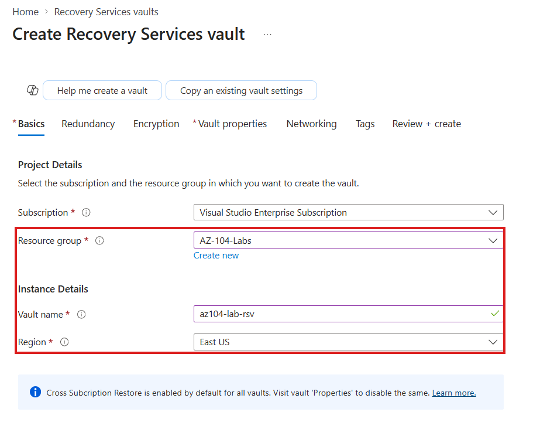
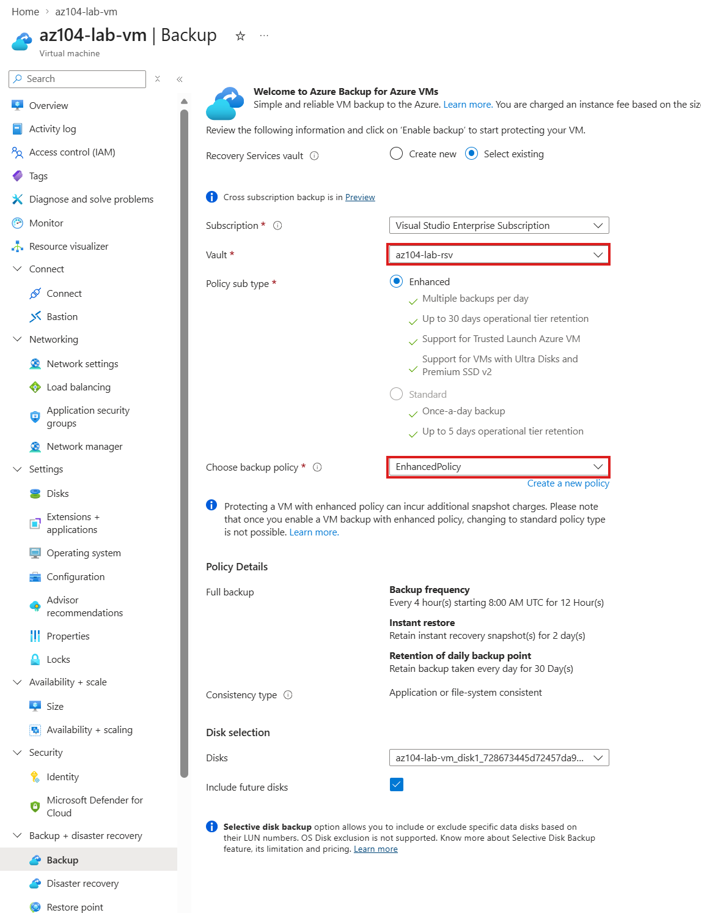
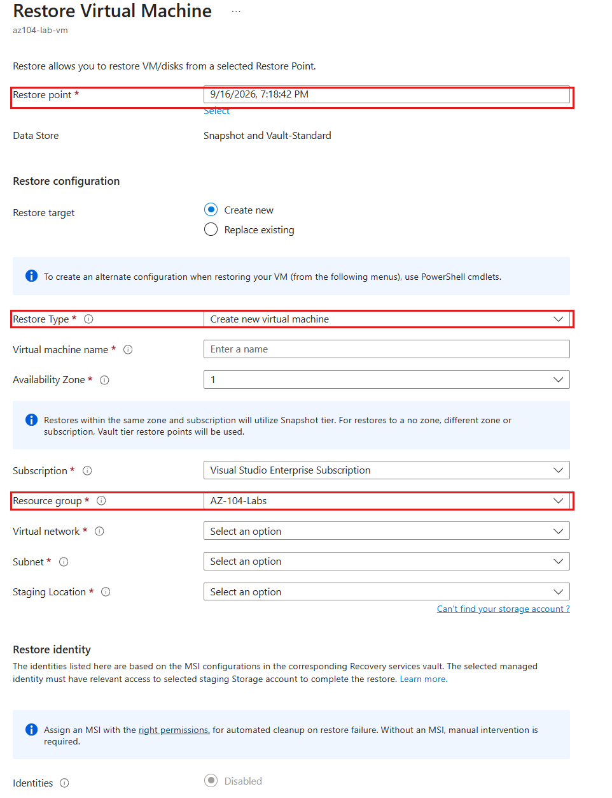
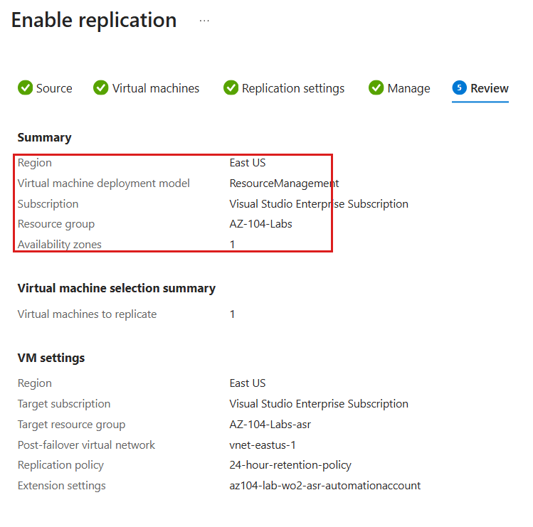

# Walkthrough — Azure Backup: Recovery Services Vault & VM Restore (Lab 14)

A guided, portal-first walkthrough of what [Lab 14](../../labs/14-backup-recovery/) deploys, plus the manual backup/restore/Site Recovery tasks that make up most of this lab. The lab README covers the Bicep deploy/verify/cleanup commands and the CLI equivalents — this walkthrough is for clicking through the vault and its wizards so "protected item" and "restore point" stop being terms and become things you've actually created and clicked through.

**Prerequisite:** Lab 14 is already deployed (`az deployment group create ...` from the lab README) and you have the resource group open in the [Azure Portal](https://portal.azure.com).

## Part 1 — The vault and policy, as deployed

1. Open your resource group (`rg-az104-lab14`) and click into **rsv-az104lab14**.

2. On **Overview**, note there's nothing to protect yet — a fresh vault is an empty shell until something is backed up into it.
3. In the left-hand menu, under **Manage**, select **Backup policies**.
4. Open `policy-az104lab14-daily` and confirm the **Backup schedule** (daily, at the UTC time you deployed with) and the **Retention range** (7 daily points by default).

If you skipped the manual backup task, this is as far as the vault goes — and that's a completely valid way to have done this lab. The rest of this walkthrough assumes you went on to do at least Part 2 of the lab's manual tasks.

## Part 2 — Enable backup on a VM

1. Navigate to the VM you're protecting (e.g. `vm-az104lab06`, if Lab 06 is still deployed).
2. In its left-hand menu, find **Data protection** (or **Backup**, depending on your portal version) under **Settings**.
3. Select `rsv-az104lab14` as the **Recovery Services vault**, then `policy-az104lab14-daily` as the **Backup policy**.

4. Click **Enable backup**. This kicks off the protection association — give it a minute or two.
5. Back on the vault, under **Protected items**, select **Backup items**. You should now see the VM listed with a status (initial state is often "Protected — Initial backup pending" until the first backup job runs).

## Part 3 — Trigger and watch an on-demand backup

1. From the vault's **Backup items** list, select your VM, then **Backup now** from the top action bar.
2. Accept or adjust the retention date offered, then confirm.
3. Go to **Manage → Backup jobs** to watch the job progress from **In progress** to **Completed**. A first backup takes longer than subsequent ones — it's copying the full disk, not an incremental.
4. Once complete, go back to **Backup items → (your VM)** and look at the **Restore points** — you should now see one, timestamped to match the job you just ran.

## Part 4 — Walk the restore wizard (without completing it, unless you want to)

1. From the VM's **Backup items** detail page, select a restore point, then **Restore VM**.

2. Step through the wizard's tabs:
   - **Basics** — recovery point selection, and the OS type Azure detected.
   - **Restore Configuration** — this is where **Create new**, **Replace existing**, and **Restore disks only** show up as distinct choices. Read each option's description in the portal before picking one.
   - **Create new** asks for a new VM name, resource group, and VNet — nothing about the original VM changes.
   - **Replace existing** is the one to be careful clicking through live in a classroom — it genuinely overwrites the original VM's disks.
   - **Restore disks only** skips VM creation and just restores managed disks you'd attach yourself.
3. If you want to actually complete a restore, **Create new** is the safe option to demo live. Otherwise, you've seen the full wizard anatomy — cancel out without submitting.

## Part 5 — (Optional, clearly separate) Site Recovery replication and failover

Only do this part if you've read the lab README's warning about it first: it needs a second region, a VM kept running long enough to replicate, and meaningfully more time than anything else in this course. This is exploratory, not a routine lab step.

1. On the vault, under **Getting Started**, select **Site Recovery**.
2. Choose **Azure virtual machines**, then **Replicate**.
3. Pick the source VM, then a **target region** (must differ from the source), target resource group, and target VNet.

4. Click **Enable replication** and wait — initial replication sync can take anywhere from 30 minutes to several hours depending on disk size.
5. Once the vault's **Replicated items** page shows the VM in a healthy replication state, select it and click **Failover**.
6. Pick a recovery point, then **Commit** to actually bring up the failed-over VM in the target region.
7. When you're done exploring, tear this down deliberately: disable replication from the **Replicated items** page, and delete the failed-over VM and its disks in the target region. Neither of those is touched by `rg-az104-lab14`'s resource group delete.

## What you learned

Walking through this lab in the portal, you should now be able to:

- **Read a Recovery Services vault's backup policy** (schedule and retention) end to end, and distinguish a deployed-but-unused vault from one with active protected items.
- **Enable backup on a VM through the Data protection wizard** and confirm protection status from the vault's Backup items list.
- **Trigger and monitor an on-demand backup job**, and locate the resulting restore point once it completes.
- **Walk a VM restore wizard's Restore Configuration tab** and explain the blast-radius difference between Create new, Replace existing, and Restore disks only.
- **Explain, from having seen both wizards, why Backup and Site Recovery are different features sharing one vault type** — same-region point-in-time recovery versus cross-region disaster-recovery replication.
- **Recognize Site Recovery's replication and failover workflow as a deliberately heavier, optional exercise** — not something to casually repeat — and know to tear down both the replication and any committed failover VM afterward.
