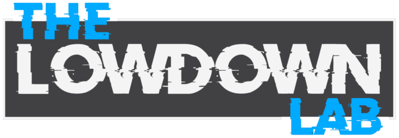

  

<h1 align="center">MSFT-Training</h1>

Free hands-on lab companions for <a href="https://thelowdownlab.com">The Lowdown Lab</a>'s Microsoft certification courses.

  
  

---

Each course folder is a self-contained, free companion repo to its paid Lowdown Lab video course — deploy real (or near-real-cost) Azure resources alongside the course instead of only watching slides.

| Course | What it covers | Labs |
|---|---|---|
| [`AZ-900/`](AZ-900/) | Azure Fundamentals | 9 labs |
| [`AZ-104/`](AZ-104/) | Azure Administrator Associate | 15 labs |

These sit in the AZ-900 → AZ-104 → AZ-305 progression — start with AZ-900 if you're new to Azure, move to AZ-104 for admin-level configuration depth.
